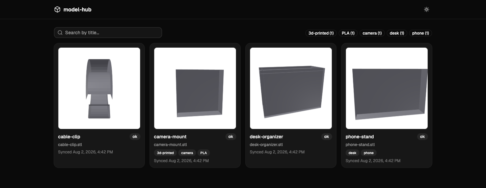
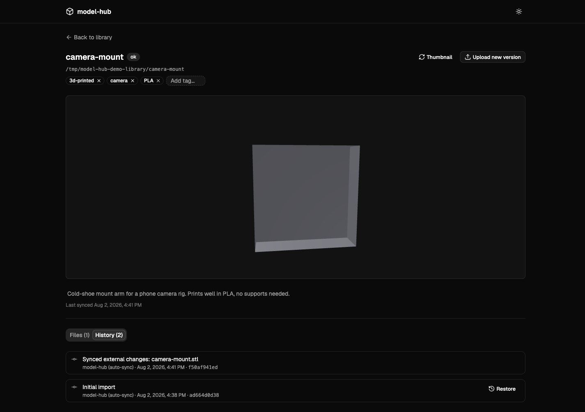
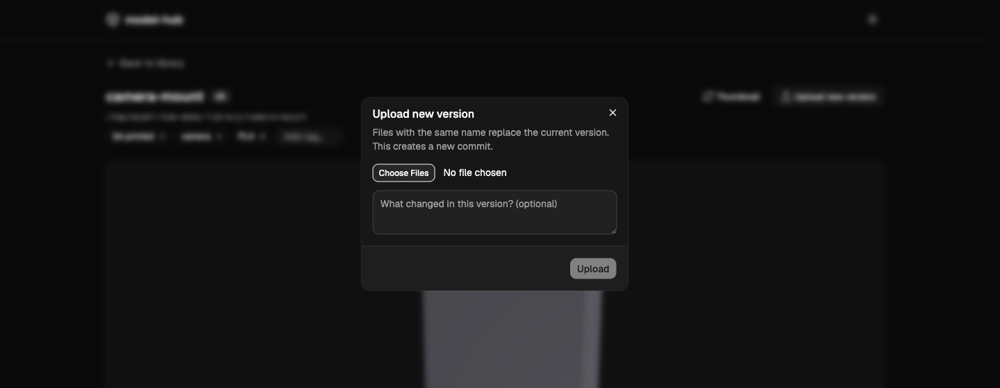

# model-hub

A self-hosted 3D model library (STL/3MF). Point it at a directory containing
one subfolder per project and it adopts what's already there — no import
step, no re-organizing required. Every project's file history lives in a
real git repo, kept in sync transparently whether a new version comes
through the web UI or you just drop files onto the share yourself. Tags,
descriptions, and thumbnails live in a small local SQLite database
alongside it.

> [!WARNING]
> **AI Slop / Vibe Coded Project** — This project was "built" with heavy AI
> assistance to scratch a personal itch. The code works for my use case, but
> it has not been hardened, audited, or battle-tested. Deploy at your own
> risk, preferably not exposed to the open internet. No warranties, no
> support guarantees, no promises.

## 📸 Screenshots

<table>
  <tr>
    <td align="center"><b>Library</b></td>
    <td align="center"><b>Project detail</b></td>
    <td align="center"><b>Upload a new version</b></td>
  </tr>
  <tr>
    <td></td>
    <td></td>
    <td></td>
  </tr>
  <tr>
    <td align="center">Search and filter by tag</td>
    <td align="center">3D viewer, tags, and full git history per project</td>
    <td align="center">Every upload is a commit</td>
  </tr>
</table>

## Features

- **Non-destructive adoption** — point `LIBRARY_ROOT` at a directory you
  already have; each subfolder becomes a project as-is, nothing is moved,
  renamed, or restructured.
- **Real version history, not a blob store** — every project directory is a
  real git working tree. Upload a new version from the UI, and it's a
  commit with your description as the message. Edit files directly over
  NFS/SMB instead, and a periodic scan (plus an optional live watcher)
  picks up the change and commits it automatically — the History tab
  visually distinguishes "you did this" from "we noticed this changed on
  disk." Any past version can be restored as a new commit.
- **Local SQLite metadata** — tags, descriptions, and thumbnail state live
  in a single SQLite file. The filesystem + git are always the source of
  truth for file content; the database is just a cache/index on top, so it
  can be safely deleted and rebuilt from what's on disk.
- **Automatic thumbnails** — a headless Chromium instance renders each
  project's primary model and writes a thumbnail to disk, using the exact
  same STL/3MF loading code as the interactive 3D viewer.
- **Tags & search** — organize and filter your library by tag, with
  case-insensitive dedup.
- **OIDC auth, optional** — plug in Authelia, Authentik, Keycloak, or any
  standard OIDC provider. Leave it unconfigured and the app runs in
  single-user mode with no login screen at all.
- **Sleek, modern UI** — React + shadcn/ui, dark mode included, with an
  interactive react-three-fiber viewer for STL/3MF files.

## Running with Docker

```bash
docker compose up -d
```

Edit `docker-compose.yml` first: set the bind mount under `volumes` to your
actual library directory. The app is then at `http://localhost:4000`.

Pre-built images are published to `ghcr.io/mirceanton/model-hub` on every
release; `docker-compose.yml` builds from source by default, but you can
point it at `ghcr.io/mirceanton/model-hub:latest` instead.

By default there's no login (single-user mode). To put it behind OIDC
(Authelia, Authentik, Keycloak, etc.), uncomment and fill in the
`OIDC_*`/`SESSION_SECRET` environment variables in `docker-compose.yml` —
see `apps/server/.env.example` for what each one does.

If your library lives on an NFS/SMB mount, set
`LIBRARY_WATCH_USE_POLLING: "true"`, since inotify events are often
unreliable across network filesystems; a periodic full-library scan runs
regardless as a backstop.

`GET /metrics` exposes Prometheus-format metrics (thumbnail queue depth,
sync scan duration, HTTP request counts, etc.) and, like `GET /healthz`,
is unauthenticated by design — even when OIDC is enabled — so it stays
scrapeable without a session or token. If this instance is reachable
beyond a trusted network, firewall `/metrics` off at the network level.

## Development

Monorepo (pnpm workspaces): `apps/server` (Fastify API + sync engine +
thumbnail pipeline), `apps/web` (Vite/React frontend), `packages/shared`
(shared TS types).

```bash
pnpm install
cp apps/server/.env.example apps/server/.env   # then edit LIBRARY_ROOT/DATABASE_PATH
pnpm --filter @model-hub/server dev             # API on :4000
pnpm --filter @model-hub/web dev                # web on :5173, proxies /api to :4000
```

Run tests with `pnpm test` (server unit tests) or `pnpm --filter @model-hub/web build`
for a production build/typecheck of the frontend.

See `CLAUDE.md` for the full architecture.
